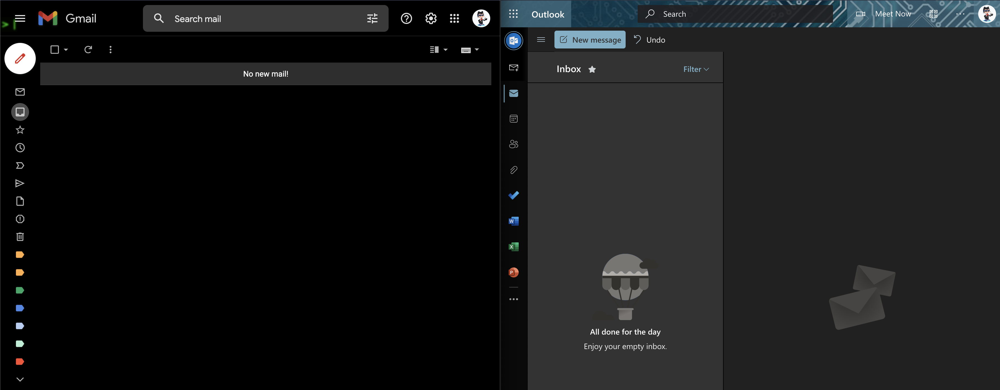

After years of professional working experience, I realize 1 thing that I couldn't do back in university: **benefits of good email management**

You may not care much or don't have time for email management, both your personal and working mailboxes. That's ok I've been through that time and I learned a lesson. In this post I will share with you some tips for making email management easier and benefits of a _clean_ mailbox

## Labelling / Categorization

2 popular mailboxes Gmail and outlook both have labelling feature. Whenever you have new mail in inbox you should try to label it to quickly search and filter mail by label later on.

This is how I label my mail:

- **Identify a pattern** of mails you've been receiving so far (e.g. Medium newsletter, e-commerce, reminder, job finding)
- **Create label per pattern** you identify. Try to use **lowercase/Uppercase letter with no space** and choose **color** to easily distinguish (color can be helpful when browing bunches of emails with diffent labels).
- When new email comes, identify the pattern and **assign a known label** to it
- If pattern is _new or rarely occurs_ and you don't know which label to assign to, you can either leave it unlabeled or create and assign `tbd` label to it.

Overall, labelling is great but you will start to get tired when receiving bunches of mail in the morning (for work-related mailbox). You will definitely wonder: how on earth can I **simplify or automate** this process?

## Automation

Mailboxes are _smart_ now. There are features to support you with automated labelling and even many other actions.

Suppose you keep seeing new mails with similar pattern with previous ones, then why not automatically label them whenever they arrive to inbox WITHOUT any manual work? :).

Gmail has feature called [Filters](https://mail.google.com/mail/#settings/filters), you can setup there.

Besides labelling, there are many other things Filters can do for you such as `archive`, `mark as read` and `delete`.

## Mark as important, star email

Yay, automation and labelling may solve many problems. But still there will be **important emails** that you have to **revisit soon** to check for info again or reply.

If that's the case then `Mark as important` and `starring` (similar to `Flag` and `Pin` in Outlook) mail is suitable for this case. I usually have 2 levels of importance: **high and medium**, and I map them with star and mark as important respectively.

With mailbox's built-in filtering features, you can filter important or starred email in no time. As a result, you will hardly miss or forget them.

## Keep Inbox clean

I guess there is only 1 problem left to solve: an Inbox with **so many emails** displayed on the screen.

Imagine you go to your mailbox and see lots of unread and read emails in inbox, I'm sure you will start to get tired and may not want to check email at all ("been there done that" for me :D ).

The solution for this is to clean up Inbox as much as possible.

- Most of your mails don't need to stay in Inbox (newsletter, reminder, e-commernce, billing confirmation,...) and you can simply `archive` them or even `delete` once you finish reading.
- `Archive` is suitable for mail you won't read again but will **need it in far future for evidence or verification** such as billing
- `Delete` works best for **read-once** mail like advertisement or calendar's event
- You can keep mails you will follow up in near future (should NOT be over 1 month) in Inbox for quick access and reminding.

In the end, you will have a very clean Inbox with mainly new mails to check out (like my cover photo above taken from my mailboxes)

## Conclusion

Those are my tips for better email management. It may take time at first but you will be grateful later on ;).
